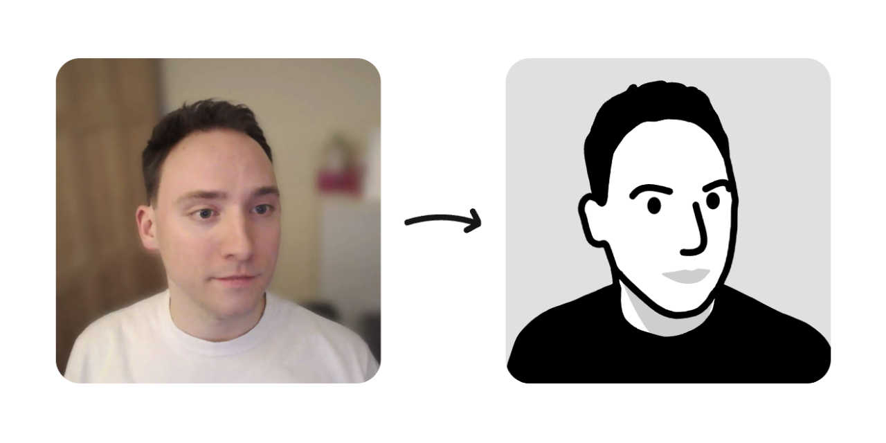

# [LineAvatars.com](https://lineavatars.com)

Website to generate Notion-style line avatars using Google's [MediaPipe AI models](https://ai.google.dev/edge/mediapipe/solutions/guide). The website runs entirely client-side and stores generated avatars in LocalStorage.

The website is built with the following technologies:

- [MediaPipe Solutions](https://ai.google.dev/edge/mediapipe/solutions/guide)
- [Potrace](https://potrace.sourceforge.net/)
- [Next.js](https://nextjs.org)
- [Tailwind CSS](https://tailwindcss.com/)

## Getting Started

Clone the repository:

```bash
git clone https://github.com/gregives/lineavatars.com
```

Install the dependencies using Yarn:

```bash
yarn
```

Run the development server:

```bash
yarn dev
```

Open [http://localhost:3000](http://localhost:3000) in your browser to see the development server.

## Contribute

I would appreciate help improving LineAvatars.com and the avatars it generates. Here is a list of some improvements I have in mind:

- [ ] Add suite of images to test
- [ ] Support all skin tones
- [ ] Support glasses and other accessories
- [ ] Support hats
- [ ] Add detail to ears

## License

Due to [Potrace](https://potrace.sourceforge.net/) being distributed under the GNU General Public License, LineAvatars.com must also be distributed under the GNU General Public License. See the [LICENSE](./LICENSE) file for details.
